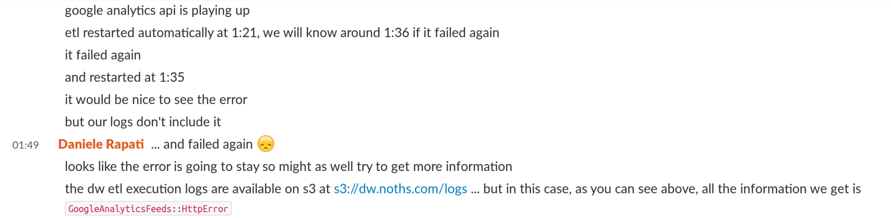
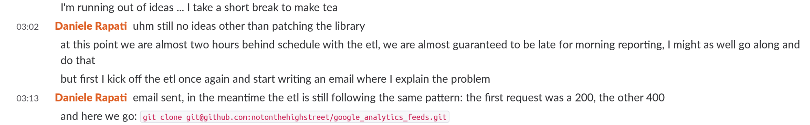
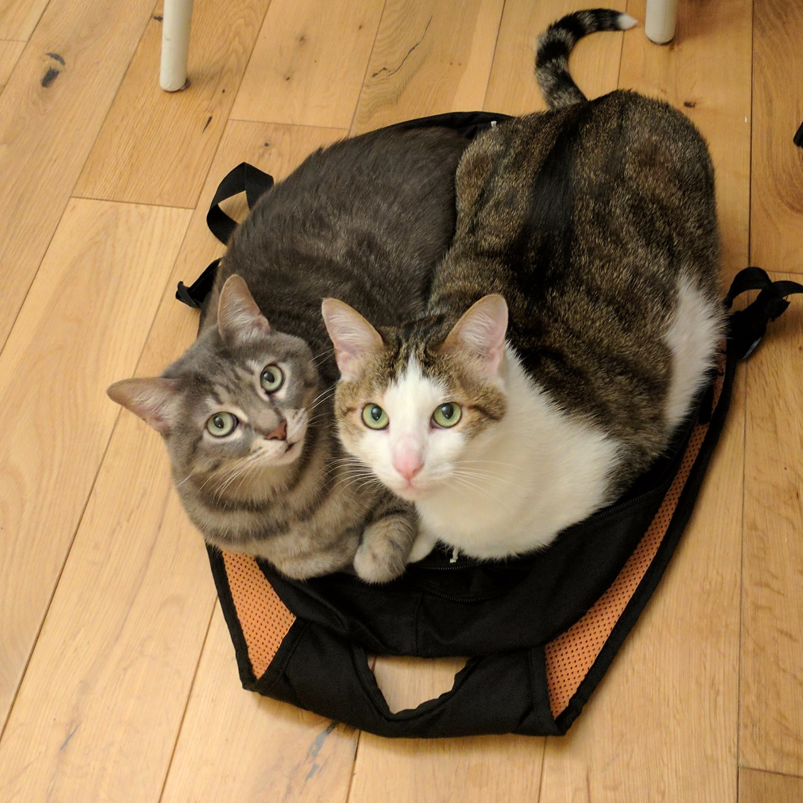

I don't like Mondays
--------------------
--------------------

What I learned about data engineering after 2 years on call
-----------------------------------------------------------

---

Daniele Rapati
--------------

[notonthehighstreet.com](https://www.notonthehighstreet.com/pages/careers-page)

[github/danielerapati](https://github.com/danielerapati)

Note:
HI, I am Daniele. I work for notonthehighstreet in London.
notonthehighstreet.com is a **marketplace** for **small creative businesses**.

**Richmond** is one of the best parts of London, there are incredible parks and river-side pubs.
It doesn't feel like London at all, it feels like a country village,
just inhabited by ambassadors and rich bankers' wifes and tech companies.

Also Richmond is where the **Rolling Stones** formed and some of us care a lot about the Rolling Stones.

---

[gitpitch.com/danielerapati/2years-oncall](https://gitpitch.com/danielerapati/2years-oncall)

Note:
this is a talk about carrying a pager, being available to respond in case something breaks, being on call.
If you are a devops or a developer you might already know something about this topic and if you are a data engineer
I am going to make a case for why you should care about this.

But I will also talk about a TV series and there is an embarrassingly high number of pictures of my cats.

As usual for a Friday evening talk I'm going to warm you up by asking a question
and you are going to **raise your hands** to answer.
Who is on call right now?

Who was on call in the last month?

Who was actually called in the last month?

If you raised your hand on the second but not on the third, well you are living the dream:
"Money for nothing and chips for free"

---
Menu
----
<--- style this slide as a restaurant menu

- Definition of on-call
- Advice on what to do when called
- Prevention (our "Day After" special)
- Motivations for on-call
- Alerting Practices

+++
Stories
------------
- Google Analytics data integration failure on 2017-07-06
- Downtown Abbey advert weekend: October 2015

Note:
In the spirit of "Total Transparency" these are real incidents

more serious people would call these "case studies"

---

What does it mean to be on call?
--------------------------------

Note:
The actual tool may vary: some refer to this as "carrying a pager"

Basically it has to do with something that is with you at all times and you care for
but it secretly hates you ...

+++?image=assets/i-hate-you-human-cropped.jpg&size=auto 90%

Note:
... so it will call at the most inopportune times

+++?image=assets/hestia-asks-cropped.jpg&size=auto 90%

Note:
... and when it needs you, you will have to give it your full attention, immediately

+++
Ownership
---------
being responsible for a system

Note:
**knowledge** inside-out, even the parts you did not develop

+++
Rewards
-------
for your time and dedication

Note:
rewards like being woken up in the middle of the night

---
What do you do when the phone rings?
------------------------------------

Note:
<< underlying story: call on 6th July 2017 >>
the phone rang at 1:15 in the morning Thursday last week

+++

> "wake up, wake up
>
> grab a brush and put a little makeup"
>
> SOAD

Note:
...
hide the scars and fade away the shakeup
have you left your keys on the table?

before you get to your computer, make sure you are awake
make coffee or tea, walk off the sleep a bit

**transition**
small rituals can help you enter the "incident" state of mind even during office hours
+++
gather information

Goal: you know what is happening

Note:
first read the alert that woke you up, really read it, at least a couple of times

now you know where to look, which system: find the error logs

you want to stop as soon as you can describe the error that has woken you up

+++
impact
------

assess the consequences

(if necessary) inform stakeholders

Note:
**be nice**

+++
"Why?"
------

+++

is the WRONG question
---------------------

Note:
don't ask why it is happening, really don't ask it, it is **not important right now**,
if you ask it you are going to **spend an unknown amount of time** on this question ...
(this might involve looking for the primal developer instinct in your brain
  and, gently but firmly, putting it back to sleep)

+++
Log as you go along

... and so on for 3 hours ...

Note:
document what you find, what you are doing, what you are thinking, why you think it,
this is **invaluable** (**especially if you are preparing a talk on being on call**)

+++
Act: resolve
------------
limit the impact

do not address the root cause

Note:
lets scroll back and read what I did last week ...
I did not really follow my own advice and ended up down a dark path of patching
libraries at 4am, without solving anything
... because instead of focusing on taking the smallest possible action
that would limit the consequences I started asking "Why"
we will see what you can do to prevent this behaviour

The action I should have taken, which we took only in the morning, was to skip
the failing data integration, accept that we would have had no information on
the sources of our traffic in the morning but we would have had all the rest of
the data available on time.

+++
It is done
----------
inform stakeholders

get back to sleep

Note:
you want to be fresh for the next day

---

How do you make sure the phone rings as little as possible?
-----------------------------------------------------------

Note:
the day after you are thinking "this is all pretty stressful: I don't want it to
happen again"

+++
Root Cause Analysis
-------------------

Note:
now is finally the time to think about "Why" and to take action, the day after,
not as soon as the phone rings

there are best practices and extensive literature on RCAs so I'm not going into
too much detail, just one slide

+++
- gather information (time-lines)
- find causes
- prioritize actions based on impact

Note:
**detective** hat on
this is when you can ask "Why" as much as you want
make sure to leave time to decide what to do about it as well

+++

The Blame Game is a useless game, don't play it!

Note:
The **nurse and the child patient story**

There is always some lesson to learn for the future

+++
Insights
--------

Incidents are more frequent at junctions

Note:
Especially if the junction is with a third party, where communication is more scarce
and easily ignored.
Watch out for points of friction in internal communication as well.

The root cause of the failure was that the "time_on_site" field in GA reporting API
was now called "session_duration", the old name had been deprecated in 2014 and finally
dropped last week.

+++
Insights
--------
Alert messages are important documentation

Note:
**care for your error messages**, keep them updated, make sure you read them and
include everything that can help you during an incident: **checklists**, **lessons learned**, **encouragement** ...

We fixed the root cause by renaming the failing field and scheduling to go through all
fields we use to see if Google deprecated any other.
But we also rewrote the alert message to include a specific recommendation not to
investigate the cause of a failure but just to skip the data integration step, if possible.

---?image=assets/downton-abbey.jpeg&size=100% auto

Note:
lets take a step back to 2015 and a broader view
<< underlying story: Downton Abbey 2015 >>
---> really tell it, this is funny

Downton Abbey is a TV show about a wealthy aristocrat British family in the
first half of the 20th century. It is wonderfully acted, the costumes and settings
are amazing ... and it is right on target with our audience. Very British.

So much on target that when we placed an advert during the first episode of the season
in October 2015, on a Sunday evening, the additional traffic and sales brought our website down.
In less than 15 minutes after the advert aired.
And again an hour later when it aired on the +1 channel.

On one side I was lucky as I was not directly involved with the customer facing website,
but on the other side the situation on the data infrastructure was a lot worse.

The replica of the production database we used to read from was off-line since Saturday morning,
we were migrating it between data centers (we were changing hosting provider
and migrating to a well known three letters cloud hosting platform) and we had not planned
and coordinated enough on when replication between environments would stop.

Our networks and databases expert devops, the semi-mythical hero who knew how to solve
the replication problem, was on a plane back from Russia. He landed late Sunday evening and, as soon
as he turned on the phone he received so many calls his battery died before he got home.

<--- Why did we care?
Two incidents at the same time: one on our consumer website and one crippling the data infrastructure.
The same data infrastructure that we would have used to estimate the impact of the main incident.

<--- Monday ... I don't like Mondays
This was Sunday evening, the next day was a Monday.
On Monday our data infrastructure sees the most usage as it is both our busiest trading day
and the day we look back at the past week and plan for the one starting.
I do not like Mondays.
And this was not a normal Monday.

At the time when we were **a lot more inexperienced than today** and we learned a lot from
these events. We **learned** as an **organization** and as a **team** and we **changed**. Lets talk about that.

---

Is it worth reacting to errors as soon as they happen?
------------------------------------------------------

Note:
how do you answer this question?

+++

- Impact
- Dependencies

Note:
You start from the __Consequences__

**Who is affected** by your service being unavailable or wrong?
Do they **depend** on your service? How? How much? What would they have to do to work around the problem?
What will they not **know**? Can they **wait**? How long? At what **cost**?

In 2015 we were realizing that our data infrastructure was increasingly a dependency
for our coworkers, especially as a source of information for making decisions.

+++

When you are offering external services

Note:
You probably want to support public facing services with an on-call policy.
Because you **cannot control** how much external people depend on you, you might have **contracts**
in place and your **revenue** might depend on the service you are offering.

In 2016 we started offering to our **partners**, the businesses that sell on the notonthehighstreet marketplace,
access to a **rich dashboard** with their **sales** figures and multiple statistics on how their
**products are performing**.

At this point there was no more space to go back on on-call and support policy

+++
Increasing Trust internally

Note:
But even for internal services there can be a strong benefit
Your **coworkers** will have to **worry less** and less about limitations with
the tools and data they are using. **Spend less time checking.
They will see benefits in their daily work
and will increase their trust not only in your services but in the team as a whole.

It is not just about keeping happy Mr Carson, the Butler.
We also want Daisy the assistant cook the be the best she can be at her job.

You might pay this increase in trust, and supporting an external service,
with **less control on your priorities** and **less agility** as you have to react more.

+++

Allow others to build on solid ground

Note:
(this is the message!!!)

but in the end it will be worth it
because you are **enabling others** to **rely** on your tools and data **enough to build** upon them.
**Their success depends** on your stability and you will be surprised by the
**brilliant, creative, unexpected ways** they will use your product if they can trust it.
Enabling others.

Nothing else matters.

+++

Together we can go anywhere
---------------------------

---

How do you make sure the phone rings when it should?
----------------------------------------------------

Note:
so having an on-call is worth the pain
<< underlying story: Downton Abbey 2015, the days, weeks, months after >>
What did we do in the days, weeks, months after the Downton Abbey debacle to make it work?

+++
Alerting
--------
- basic tools: email, chat

- specialized applications: PagerDuty, OpsGenie, Twilio, etc.

- accessible logs

- incident response documentation

Note:
the **very basic** is getting an **email** when a certain program fails

and that is what we had at the time

from that you can build, integrate with a tool that will page you
on your phone and wake you up.

You can do it yourself with Twilio if you want.

You can also **send lower priority alerts and messages to a chat tool** so you have
a timeline of events in one place and you can comment on them, keep a log of incidents, etc.

Make sure your logs are accessible to the persons responding to incidents and they know
how to access them and how to operate the systems during an incident

**training and documentation**

+++
Monitoring: Systems
-------------------

if you care about something measure it and graph it

Note:
the next step is moving from gathering information only during failures to
collecting metrics and statistics all the time.
From technical information like how many jobs run, how long did they take,
how much cpu, ram and disk, how much data moved, how much disk space left
to more high level information like how many pages
served, how many purchases, how many customers served, etc.

You can then plug your alerting on top of your monitoring rather than explicitly trigger alerts.

<The system we use for this is **Datadog**, there are multiple alternatives, both paid and free.>

+++?image=assets/1972-11-21.jpg&size=auto 95%

<h3 style="color: #fff">Monitoring: Data</h3>

Data Quality

 
 
 
 

Note:
The next step is **monitoring your data itself**.
Your business data and your monitoring data.
Is 20K customers on the site at the same time normal for a Sunday evening?
Have we received the data we expected from Google Analytics? Was there a high ratio of
traffic with an unidentified source? What is the "normal" level?

I cannot stress enough how powerful this way of looking at your data can be. It is
basically an early warning system for your organization and for your computer systems
combined.

There is a **lot of literature on Data Quality** if this argument picks your interest.
And ignore the association with some big old software vendors: these concepts are
general and not dependant on technologies.

<The system we use for monitoring our business data is **redash**, by Arik Frahimovich.
I really advise you to check out redash, especially if you are interested in
making your data accessible to a wider internal audience.
It is a wonderful Python tool for Data Democratization
and that is a whole different conversation, and Arik gave it at the Talk Python to Me podcast ...>

+++
Alert Fatigue
-------------
- Beware too many alerts
- Zealousness and Discipline

Note:
So now we have **lots of checks and alerts** that can trigger.
Some require immediate action, other can wait.
And maybe some we can ignore ...
Don't get Comfortably Numb! Read each alert, respond to it,
but also examine if it is useful, if it can be improved, if you need to update it
or remove it.
**Classify alerts** by system, business area, type of error and priority.
Ideally **every new feature** or bug has some monitoring and alerting attached.
Use the information to **guide your decisions**, both technical decisions and
wider product decisions.

+++
This is just the beginning
--------------------------

---
Resources
---------
- [Julia Evans: What can developers learn from being on call?](https://jvns.ca/blog/2017/06/18/operate-your-software/)
- [Charity Majors on Twitter](https://twitter.com/mipsytipsy/status/847508734188191745)
- [Coursera: Unethical Decision Making in Organizations](https://www.coursera.org/learn/unethical-decision-making)
- [Laura Sebastian-Coleman: Measuring Data Quality for Ongoing Improvement](https://www.elsevier.com/books/measuring-data-quality-for-ongoing-improvement/sebastian-coleman/978-0-12-397033-6)

Note:
this is an **opinionated selection**

---?image=assets/tough-love.jpg&size=auto 95%

<h3>Thank you</h3>
<h3>Questions?</h3>

Note:
thank you particularly to those ops, dev-ops and engineers who have been on-call for years
and have kept our systems running with their work and dedication and sheer force of will.

Thank you Olivier, Henrique, Gregory, Justin, Tom, Antonio, Ozskar, Alexander, Piotr and Allan.

---

Daniele Rapati
--------------

[notonthehighstreet.com](https://www.notonthehighstreet.com/pages/careers-page)

[github/danielerapati](https://github.com/danielerapati)
